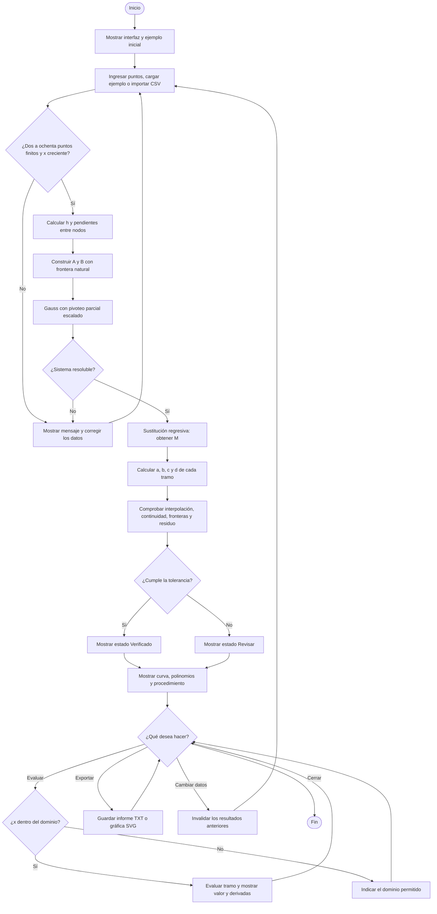

# Diagrama del programa

La versión vectorial está en [diagrama_flujo.svg](diagrama_flujo.svg). Este código Mermaid permite mantener el diagrama editable.

```mermaid
flowchart TD
    inicio([Inicio]) --> interfaz[Mostrar interfaz y ejemplo inicial]
    interfaz --> datos[Ingresar puntos, cargar ejemplo o importar CSV]
    datos --> validar{¿Dos a ochenta puntos finitos y x creciente?}
    validar -- No --> error[Mostrar mensaje y corregir los datos]
    error --> datos
    validar -- Sí --> distancias[Calcular h y pendientes entre nodos]
    distancias --> sistema[Construir A y B con frontera natural]
    sistema --> gauss[Gauss con pivoteo parcial escalado]
    gauss --> resoluble{¿Sistema resoluble?}
    resoluble -- No --> error
    resoluble -- Sí --> sustitucion[Sustitución regresiva: obtener M]
    sustitucion --> coeficientes[Calcular a, b, c y d de cada tramo]
    coeficientes --> comprobaciones[Comprobar interpolación, continuidad, fronteras y residuo]
    comprobaciones --> precision{¿Cumple la tolerancia?}
    precision -- Sí --> verificado[Mostrar estado Verificado]
    precision -- No --> revisar[Mostrar estado Revisar]
    verificado --> resultados[Mostrar curva, polinomios y procedimiento]
    revisar --> resultados
    resultados --> accion{¿Qué desea hacer?}
    accion -- Evaluar --> dominio{¿x dentro del dominio?}
    dominio -- Sí --> evaluar[Evaluar tramo y mostrar valor y derivadas]
    dominio -- No --> avisar[Indicar el dominio permitido]
    evaluar --> accion
    avisar --> accion
    accion -- Exportar --> guardar[Guardar informe TXT o gráfica SVG]
    guardar --> accion
    accion -- Cambiar datos --> invalidar[Invalidar los resultados anteriores]
    invalidar --> datos
    accion -- Cerrar --> fin([Fin])
```
